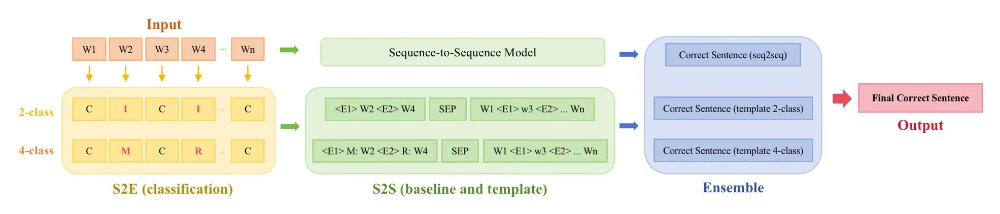

# ETTE (Error type based Template T5 Ensemble GEC model)

**Author:** Lin Liangtao, Huang shijie, Li Zeyun, Anweshan Bor, Tan Xiu Ping, Anocha Sutaveephamochanon

**Institute:** CS4248 Final Project - Team 1

# Abstract

Grammatical Error Correction (GEC) has gained significant attention in Natural Language Processing (NLP) due to the prevalence of grammatical errors in written communication, which can obscure the clarity and professionalism of the text. This report investigates neural Sequence-to-Edit (S2E), Sequence-to-Sequence (S2S), and an innovative combined pipeline method Error type based Template T5 Ensemble (ETTE) for GEC on the WI-LOCNESS corpus, aiming to generate fully corrected sentences. We apply a pretrained ensemble method to combine the outputs of multiple models, achieving an F$_{0.5}$ score of 70.85 on the WI-LOCNESS test set and ranking 13th on the leaderboard. Experiments are conducted to evaluate the performance and challenges of these approaches, providing insights into their effectiveness and areas for improvement. Our work also surveys related research in rule-based, statistical, and neural GEC approaches, highlighting the advancements in the field. The findings contribute to advancing GEC research and developing practical tools to enhance written text quality, benefiting students, professionals, and others who rely on clear and accurate written communication.

# Method


# Experiments
## 1. S2E
Please see `ETTE/1-S2E/README.md` for environment installation
run `runs2e.sh` for the whole sequence of steps- preprocess, train, plot results, evaluate and store scores, generate predictions for training, validation and test data then finally generate predictions for the actual test data. The predictions for the final test data will be stored in `./actualTestPredictions/binTestPred.txt` and `./actualTestPredictions/multiTestPred.txt` for binary and multi class respectively

## 2. S2S
### Data preprocessing
In order to conduct sequence to sequence(S2S) experiments and template to sequence (S2E+S2S) experiments, we need to preprocess the original data and the data predicted by S2E. For details on the data preprocessing script, please see `data_preprocess.ipynb`.

### 2.1 RNN
* This section of code are for GEC task adopted from various sources 
* All are edited by Anocha S
* Last edit: Apr 2024

**GEC using RNN from CS4248 ipynb**

> Preparing data
- using same sentence pairs from Liang
- `convert2pair.py` for json to txt 
- `3.1 Data Preparation.ipynb`keep using `spacy.load("en_core_web_trf")`
-- `src.vocab`
-- `tgt.vocab`
-- `vectorized.txt`

> Train
- `3.2 RNN MT.ipynb`
- using Same RNN architecture as deu-eng
- using
    ```
    "vocab_size_encoder": 20006,        # the size of the source vocabulary determines the input size of the encoder embedding
    "vocab_size_decoder": 19591,        # the size of the target vocabulary determines the input size of the decoder embedding
    "embed_size": 300,                           # size of the word embeddings (here the same for encoder and decoder; but not mandatory)
    "rnn_cell": "LSTM",                          # in practice GRU or LSTM will always outperform RNN
    "rnn_hidden_size": 512,                      # size of the hidden state
    "rnn_num_layers": 2,                         # 1 or 2 layers are most common; more rarely sees any benefit
    "rnn_dropout": 0.2,                          # only relevant if rnn_num_layers > 1
    "rnn_encoder_bidirectional": True,           # The encoder can be bidirectional; the decoder can not
    "linear_hidden_sizes": [1024, 2048],         # list of sizes of subsequent hidden layers; can be [] (empty); only relevant for the decoder
    "linear_dropout": 0.2,                       # if hidden linear layers are used, we can also include Dropout; only relevant for the decoder
    "attention": "DOT",                          # Specify if attention should be used; only "DOT" supported; None if no attention
    "teacher_forcing_prob": 0.5,                 # Probability of using Teacher Forcing during training by the decoder
    "special_token_unk": vocab_tgt['<UNK>'],     # Index of special token <UNK>
    "special_token_sos": vocab_tgt['<SOS>'],     # Index of special token <SOS>
    "special_token_eos": vocab_tgt['<EOS>'],     # Index of special token <EOS>
    ```
- using `CrossEntropyLoss()`

> Test
- using `ABCN.dev.gold.bea19.json`, `Awe/valid.m2`, `test/ABCN.test.bea19.orig`
- using Chris' `3.1 - Data Preparation (MT)` to create `vectorized.txt`
- using Chris' `3.2 Test section` to test
- getting `xxx.out`
- using post processing removing duplicate tokens
- using NUS's m2scorer (modified 4 python 3)
```
>>> python ./m2scorer.py -v ../../ChrisRNN/ABC.train.110-src-tgt-rnn.unique.out ../../ChrisRNN/ABCN.dev.gold.bea
19.4382.m2 > m2scorer.V2110unique.lower.log
```


Note that: `en_core_web_trf` is case sensitive
```
>>> import spacy
>>> nlp = spacy.load('en_core_web_trf')
>>> nlp.vocab.strings['apple']
8566208034543834098
>>> nlp.vocab.strings['Apple']
6418411030699964375
```

**Sequence to Edit using Flair, sentence labelling (https://github.com/flairNLP/flair)**
- Prepare dataframe for sentence labeling
- Edit `train.py`
This source adopt an idea of training ner using flair from Akash Chauhan May 3, 2020
But replace 'ner' with 'edit' since they are all encoder only for labelling task
https://github.com/flairNLP/flair.git
https://medium.com/thecyphy/training-custom-ner-model-using-flair-df1f9ea9c762

Last modified: Anocha 2/4/2024 
### 2.2 BART
* To train `BART` model :
  * `cd ETTE/2-S2S/BART` and run `sh ./train.sh`

### 2.3 T5-large
* To train `T5` model only:
  * `cd ETTE/2-S2S/T5` and run `sh ./scripts/train_t5_baseline.sh`
* To train `T5` model with template:
  * `cd ETTE/2-S2S/T5` and run `sh ./scripts/train_t5_template.sh`
* Using `T5` model for inference:
  * `cd ETTE/2-S2S/T5` and run `sh ./scripts/generate_t5.sh`

### Evaluation
Prepare the original `m2` file and the `txt` file from model prediction (each line is the corrected text)
* 1.`cd ETTE/2-S2S/metric`
* 2.`sh compute_bea2019_m2.sh`

## 3. Ensemble
To use the pre-trained combination model to get the final result, run the following command

```cmd
cd greco

pip install -e requirements.txt

wget -P models https://sterling8.d2.comp.nus.edu.sg/~reza/GRECO/checkpoint.bin
```

Then, put the results from the previous models into `results/test` and `results/dev`

Run the pre-defined scripts to get the final output.

For the development set:

```cmd
sh scripts/run_dev.sh
```

For the test set:

```cmd
sh scripts/run_test.sh
```

At last, compress bea-19-test.txt into a zip file and upload it to https://codalab.lisn.upsaclay.fr/competitions/4057#participate

## References
* **BEA 2019 Shared Task - Grammatical Error Correction:** https://codalab.lisn.upsaclay.fr/competitions/4057
* **ged_baselines:** https://github.com/gotutiyan/ged_baselines
* **TemplateGEC:** https://github.com/li-aolong/TemplateGEC
* **greco:** https://github.com/nusnlp/greco


